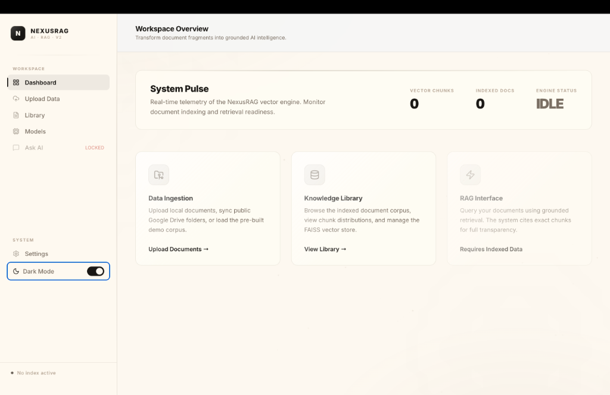
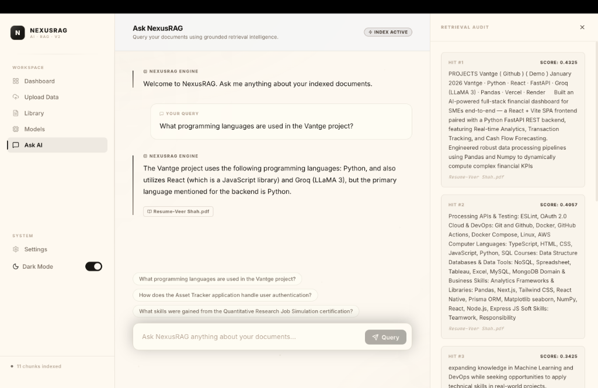

# NexusRAG — Intelligent Document RAG System

NexusRAG is a lightweight, AI-powered document assistant designed for processing, indexing, and querying multi-format text documents. It allows users to upload local files or synchronize entire Google Drive directories, transforming static text into a highly intelligent, interactive knowledge base using Retrieval-Augmented Generation (RAG).

## 🖼️ Application Previews

### 1. Workspace Overview & Data Ingestion

*A sleek, matte-black and creamy-ivory dashboard providing real-time telemetry on vector chunks, indexed documents, and the active LLM engine status. Users can ingest local PDFs or sync public Google Drive folders.*

### 2. Intelligent RAG Interface & Retrieval Audit

*The dynamic query interface featuring grounded LLM responses. The right-side "Retrieval Audit" drawer provides full transparency into the semantic vector search, showing exact context chunks and relevance scoring for maximum traceability.*

---

## 🏗️ Architecture & Tech Stack

### Frontend
- **Framework**: React 18 + Vite (Single Page Application)
- **Styling**: Vanilla CSS with custom-built responsive components, dynamic light/dark mode CSS variables, and glassmorphism.
- **Icons & UI Elements**: Lucide React.
- **Session Management**: Custom `x-user-id` local storage header generation to natively bypass browser proxy cookie restrictions and seamlessly support multi-tenant local environments.

### Backend (API & Engine)
- **Server**: FastAPI + Uvicorn (Asynchronous REST API)
- **Vector Database**: FAISS (Facebook AI Similarity Search) used for ultra-fast, local similarity matching.
- **Embedding Model**: `sentence-transformers/all-MiniLM-L6-v2` (Local execution for speed and privacy).
- **LLM Integration**: Groq API (LLaMA-3) & Google Gemini (1.5 Flash).
- **Extraction & Processing**: `pdfplumber` (for highly accurate PDF parsing) and NLTK for structured chunking.

---

## 🚀 Setup Instructions

### Prerequisites
- Node.js (v18+)
- Python (3.10+)
- A Groq or Google Gemini API Key

### 1. Backend Setup
Navigate into the root directory and set up the Python environment:
```bash
# Create and activate a virtual environment
python3 -m venv venv
source venv/bin/activate  # On Windows: venv\Scripts\activate

# Install dependencies
pip install -r requirements.txt

# Create a .env file and add your API keys
echo "GROQ_API_KEY=your_groq_key_here" > .env
echo "GEMINI_API_KEY=your_gemini_key_here" >> .env
echo "LLM_PROVIDER=groq" >> .env
```
Run the FastAPI server:
```bash
uvicorn main:app --reload
# The backend will start on http://127.0.0.1:8000
```

### 2. Frontend Setup
Open a second terminal, navigate to the `frontend` folder, and run the React app:
```bash
cd frontend
npm install
npm run dev
# The frontend will start on http://localhost:5174
```

---

## 🧠 Design Decisions & Features

1. **"Bring Your Own Key" (BYOK) Architecture**  
   Rather than locking users into a single hardcoded LLM, a dedicated **Models** configuration page was built. Users can dynamically inject their personal Groq or Gemini API keys in the UI, overriding server defaults instantly without restarts.
   
2. **True Multi-Tenant Architecture (Without Cookies)**  
   To fulfill the "multiple users" requirement smoothly on local `localhost:5174` dev servers (where cross-port cookies frequently fail), the system generates a persistent UUID in the frontend's `localStorage`. This UUID is explicitly sent as an `x-user-id` header in a centralized `apiFetch` wrapper. The backend automatically provisions isolated FAISS directories (`/storage/<user_id>`) for concurrent users.
   
3. **Transparent "Retrieval Audit" Drawer**  
   AI hallucinations are a major problem in RAG. To solve this, the chat interface features a slide-out drawer that exposes exactly which chunks the FAISS engine retrieved, along with their mathematical relevance scores (`L2` / `Cosine` converted to probabilities).
   
4. **Targeted Document Deletion**  
   The local FAISS index (`IndexFlatIP`) technically does not support arbitrary ID removal easily. To bypass this, we implemented dynamic metadata re-mapping. Deleting a document instantly identifies its chunk IDs, deletes them from FAISS, compacts the remaining index, and rewrites the metadata dictionary securely without memory leaks.

---

## ⚠️ Assumptions Made
- **File Storage**: Uploaded files are temporarily stored locally in the `/uploads` directory on the server file system rather than an external cloud bucket like S3 to simplify setup.
- **Native PDF Text**: The extraction engine uses `pdfplumber` for robust text extraction. It assumes uploaded PDFs have native text layers. Complex OCR scanning of purely image-based PDFs is out of scope for this lightweight implementation.
- **Size Limitation**: A hard limit of 50MB is enforced on the frontend and backend to protect system memory during the text extraction and embedding phases.

---

## 📖 Core API Documentation

- `POST /upload`  
  Accepts a `multipart/form-data` file. Extracts text, generates embeddings, and injects chunks into the user's specific FAISS index.
  
- `POST /sync-drive`  
  Accepts a JSON body `{ "folder_id": "string" }`. Connects to a public Google Drive link, extracts `.pdf` and `.txt` files sequentially, and indexes them into the active corpus.
  
- `GET /documents`  
  Returns an aggregated list of all parsed and indexed documents for the active user, including total chunks mapped per document.
  
- `DELETE /documents/{file_name}`  
  Physically purges a document from the FAISS vector space, removes it from the JSON metadata, and deletes the physical file from the `/uploads` directory.
  
- `POST /ask`  
  Accepts `{ "query": "string" }`. Embeds the query, retrieves the top `K=5` chunks from FAISS, constructs a grounded LLM prompt, and returns the response alongside the specific source references.

- `GET /recommend-questions`  
  Dynamically grabs 5 random context chunks from the user's FAISS index and asks the LLM to generate 3 relevant, highly specific follow-up questions tailored to their unique corpus.
